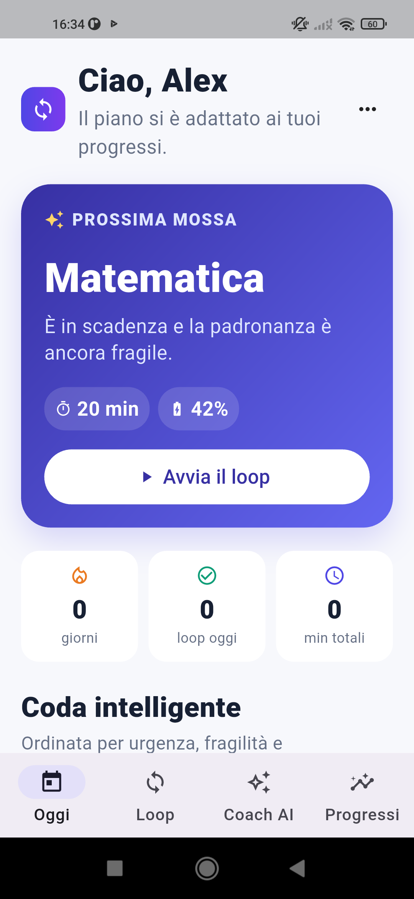

# StudyLoop

**Focus. Recall. Adapt. Repeat.**

StudyLoop is a privacy-first adaptive learning app that turns a learner's own
notes and exam date into a daily mission. Instead of counting screen time, it
measures recall, brings mistakes back, estimates exam readiness, and explains
the next useful review.

Built from scratch during OpenAI Build Week with Codex and GPT-5.6.

## Android preview

| Privacy-first onboarding | Explainable adaptive home |
| --- | --- |
|  |  |

## Why it is different

- **Explainable adaptation:** the queue combines mastery, accuracy, review due
  time, and memory decay. The student can always see why a topic comes next.
- **Notes to mission:** a topic, exam date, and pasted study material become a
  focused micro-lesson and a grounded recall challenge.
- **Mistake rescue queue:** missed questions are persisted locally and return
  at the start of the next mission until answered correctly.
- **Exam readiness:** an explicitly labeled estimate combines recall accuracy,
  subject mastery, completed missions, and unresolved mistakes.
- **Retrieval before repetition:** each focus session ends with a short recall
  check. Answers update mastery and the next review interval.
- **GPT-5.6 Coach:** GPT-5.6 Sol turns a learner's topic and optional notes into
  a schema-validated micro-lesson and exactly three age-appropriate questions.
- **Useful without AI:** a curated offline mode keeps the complete demo flow
  available when the backend is unavailable.
- **Privacy by design:** progress is stored locally. The OpenAI key never ships
  in the APK, API responses are created with `store=False`, and obvious email
  addresses or phone numbers are rejected by the backend.

## Product flow

1. The learner chooses a grade level and focus duration.
2. They add a subject, exam date, topic, and their own notes.
3. StudyLoop creates today's grounded micro-mission.
4. A distraction-free focus timer starts.
5. Three recall questions measure what was retained.
6. Missed questions enter the rescue queue and return next time.
7. Readiness, mastery, XP, streak, and history update locally.

The goal screen includes a complete photosynthesis example so judges can test
the grounded offline flow without an API key.

## Architecture

```text
Flutter Android app
├── local learner profile and session history (SharedPreferences)
├── deterministic adaptive engine
├── curated offline quiz bank
└── optional Coach AI client
          │ HTTPS
          ▼
FastAPI backend
├── PII checks and input limits
├── OpenAI Responses API
├── GPT-5.6 Sol
└── Pydantic Structured Output → validated StudyPack
```

The backend follows OpenAI's recommended Responses API and Structured Outputs
pattern. The app never contains an OpenAI API key.

## Run the Android app

Offline demo mode requires no backend:

```powershell
cd E:\app_android\studyloop_mobile
flutter pub get
flutter run
```

To connect a hosted or LAN backend:

```powershell
flutter run --dart-define=STUDYLOOP_API_URL=https://your-backend.example
```

For a physical Android device on the same Wi-Fi, use the computer's LAN address
instead of `localhost`, for example `http://192.168.1.10:8000`.

## Run the AI backend

```powershell
cd E:\app_android\studyloop_mobile\backend
python -m venv .venv
.\.venv\Scripts\Activate.ps1
pip install -r requirements.txt
Copy-Item .env.example .env
# Put OPENAI_API_KEY in .env locally; never commit it.
uvicorn main:app --host 0.0.0.0 --port 8000 --env-file .env
```

Health check: `http://127.0.0.1:8000/health`

## Verify

```powershell
flutter analyze
flutter test
flutter build apk --debug

cd backend
.\.venv\Scripts\python.exe -m pytest -q
```

## Safety and minors

StudyLoop is a prototype for learners aged 14+ or learners using the app with a
parent/guardian. The onboarding includes an AI disclosure. The Coach is limited
to educational material, rejects obvious contact information in notes, does not
ask for personal information, and returns a strict schema. A production release
would additionally require jurisdiction-specific consent, reporting,
moderation, and data-retention controls.

## Repository map

- `lib/adaptive_engine.dart` — priority and spaced-review logic.
- `lib/app_state.dart` — local state, history, and persistence.
- `lib/ai_coach_service.dart` — backend client and offline fallback.
- `lib/ui.dart` — onboarding, daily plan, focus, quizzes, Coach, reports.
- `backend/main.py` — secure GPT-5.6 Structured Output endpoint.
- `docs/DEVPOST_SUBMISSION.md` — submission copy and demo script.
- `docs/ARCHITECTURE.md` — technical decisions and judging notes.

## Build Week evidence

This repository was created on July 19, 2026. The project was developed in the
Codex thread associated with the Build Week submission. Add the final
`/feedback` Codex Session ID to the Devpost form before submission.

## License

MIT — see [LICENSE](LICENSE).
